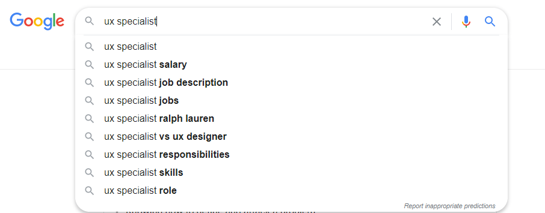

# Journal Entry 2

## Search Engines

Bret McNamee April 12, 2020

This is a concept that not all web pages have, and some that do have it, don’t implement it very well. However, the websites that are able to do it well, have a lot of success with it. The main one that I will focus on is Google.com’s search engine.  Their search engine is very, efficient and effective, in that it can predict what you may be searching for and can look it up and return relevant results quickly. The images below will take you through a google search. First you can start typing your search criteria and the top of the list of suggested searches are the most common and basic searches according to Google’s algorithms. As you go down the list the searches get a little bit of variety to your searches. The efficient part of this is where instead of having to type out your entire search, you can just click on the one of the suggested auto completed searches. Once you initiate the search you can see how **effective** and **efficient** the searches can be. The top of the searches are the most clicked on and visited website, which means these were the most useful pages that people visited. The time it took to finish the search is also shown beside the number of results that were found. This shows how quickly and efficiently the search was. You can see that the results of the “ux specialist jobs” search took 0.87 seconds and returned 13.5 million results. The top of these results are jobs that were pulled from LinkedIn and are located near the area that I did the search from. The entire process was smooth and easy, and it returned some very relevant searches.

