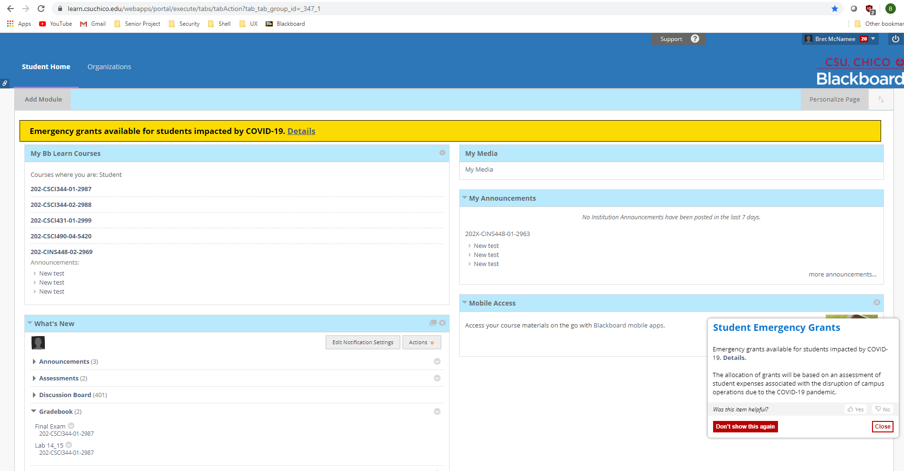

# Journal Entry 3

## The embedded home button on web pages

Bret McNamee May 10, 2020

A very useful and efficient tool that web browsers have is bookmarking. Bookmarking allows users to identify pages they frequently travel to and mark them for ease of access. The example that I have shown below correlates to many CSU Chico students and has to do with Blackboard Learn. Many students will frequently visit Blackboard Learn to see what assignments they have, turn them in, and see their grades/notes that their teachers have posted up on their class page. There are many ways to reach the site, and one of the ways is by going to Chico State’s home page, clicking the portal, then clicking on Blackboard Learn. This involves visits to a lot more pages than is actually necessary. The way that I do it is by having a bookmark that takes me directly to my classes homepage, occasionally I will have to log in with my username and password, but that is of no fault to the bookmark. It is a much more efficient way to navigate to a website that you frequently visit. There is no need to type in the url, search google for the link, or go down a rabbit hole of different pages to get where you want to go. You just need to add a bookmark. Bookmarks also allow you to sort them by categories. As you can see I tend to sort mine by classes so that I can stay organized and have an ease of access to any site I need depending on which class I am currently working on.

